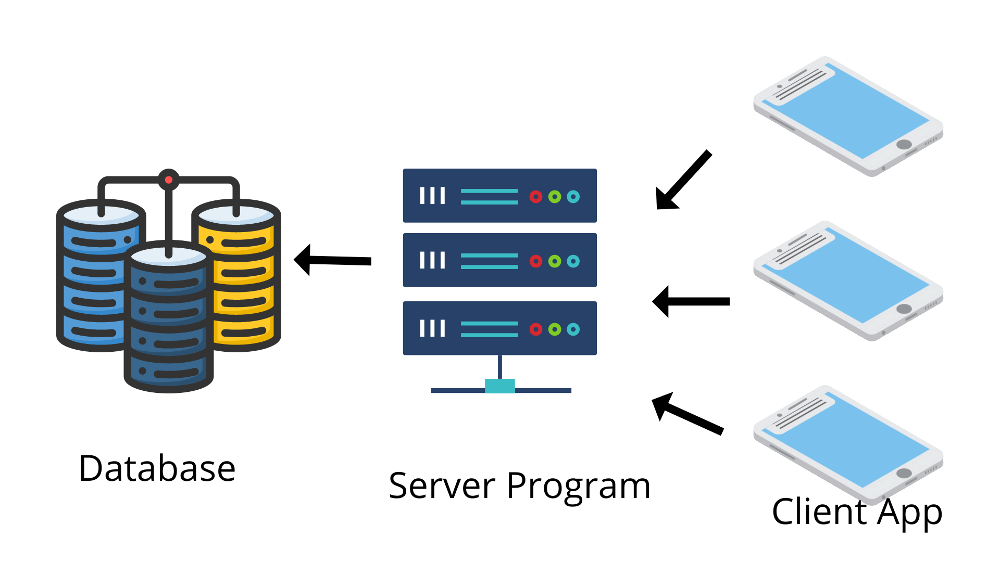

# School App

### About

The aim is to make use of technology for efficient functioning in a School.The goal of the project is to create an software solution where school teachers can upload progress status of a student and parents and students should be able to access this report using mobile application.Teachers should be able to upload score of each student in an exam and then parents should be able to see the score from their phones.The School App project is a combination of 4 programs,2 Desktop application and other 2 being android application.

### Architecture

To Develop this Program we will use a 3 tier architecture for Database.Clients willl interact with a program on server side which in turn will interact with database and provide the requested data.Sockets will be used for communication between server and client program.Server program will also maintain a log of all events happenning during execution of program

### Directory

[Server Program](./ServerProgram/) contains Source code for Server Program that interacts with database and client program

[Teacher Desktop](./TeacherDesktop/) contains Source code for Desktop Application for Teachers. This is a client program.

[Documentation](./Documentation/) contains additional documentation for this project.

### Database

To efficiently store data this project uses RDBMS.The ER Diagram and Relational Schema for Database are given below
* [ER Diagram](./Database/School%20App%20ER%20Diagram.pdf)
* [Relational Schema](./Database/School%20App%20Relational%20Model.pdf) 

Additionally [MySQL Setup Queries](./Database/MySQl%20Setup%20Queries.md) has SQL command and Instructions for Setting up Database

### Technologies

* MySQl

To store the vast amount of data that this project has to handle we have used MySQl Database. 

* IntelliJ IDE ( Community Version )

To Develop this Project efficiently IntelliJ Community Version IDE is Used.

* Java Swing

To develop GUI interface so that application is interactive Java Swing API is used.